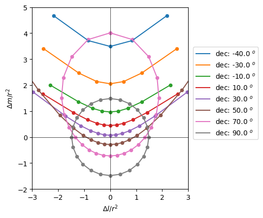

<h3 id="wide-field-imaging"> Wide-field Imaging </h3>

There are multiple effects that become important when making very wide-field interferometric images: non-coplanarity, primary beam rotation, direction-dependent phase calibration...

In this lecture we will focus on the first of these: non-coplanarity, otherwise known as the w-effect.

The term *non-coplanarity* can refer to either: 

1. the fact that we are imaging a field-of-view that is so wide it can no longer be described by a local planar appoximation to the celestial sphere; or, 
2. the fact that the antennas in our array have a significant "vertical" offset from the projected *uv* plane.
  
In both cases this is a form of non-coplanarity and it contributes to the $w$-term in the visibility equation becoming non-negligible.

#### The w-term

The spatial coherence function measured by a radio interferometer is related to the spectral intensity as,

$$
V(u,v,w) = \int{\frac{I(l,m)}{\sqrt{1-l^2-m^2}} {\rm e}^{j 2\pi [ul + vm + w(\sqrt{1-l^2-m^2}-1)]}~{\rm d}l{\rm d}m},
$$

where

 - $(l,m)$ are the direction cosines relative to the phase centre;
 - $I(l,m)$ is the spectral intensity at position $(l,m)$;
 - $(u, v, w)$ is the vector between the two interferometer elements expressed in units of wavelength.

This is more often referred to as the *visibility equation*.

* See [Thomson, Moran & Swenson, Section 3.1](https://link.springer.com/book/10.1007/978-3-319-44431-4).

The $w$-term in this equation is the final part of the exponent: $w(\sqrt{1-l^2-m^2}-1)$. In the case where $w(\sqrt{1-l^2-m^2}-1) \ll 1$ then we can ignore it completely and the visibility equation becomes:

$$
V(u,v) = \int{\frac{I(l,m)}{\sqrt{1-l^2-m^2}} {\rm e}^{j 2\pi [ul + vm]}~{\rm d}l{\rm d}m},
$$

which is just a 2d Fourier transform. 

However if $w(\sqrt{1-l^2-m^2}-1) \ge 1$ then we can't use a 2d Fourier transform without suffering from aberration effects. 

#### The w-effect

So what happens if we do use a 2d transform?

Let's look at the visibility equation again, but separating the w-term in the exponent:

$$
V(u,v,w) = \int{\frac{I(l,m)}{\sqrt{1-l^2-m^2}} {\rm e}^{j 2\pi [ul + vm]} {\rm e}^{j 2\pi w(\sqrt{1-l^2-m^2}-1)}~{\rm d}l{\rm d}m}.
$$

We can see that $w$ is only used in the exponent, which means that ${\rm e}^{j 2\pi w(\sqrt{1-l^2-m^2}-1)}$ is purely a phase term, i.e. ${\rm e}^{j \phi}$.

However, the phase is *position-dependent*:

$$\phi(l,m,w).$$

Effectively every visibility with a different $w$-value sees a different sky. And, since the $w$-value changes as a function of time, the measured sky is time-variable. 

Consequently, if we ignore the $w$-term and do a 2d Fourier transform then we will see image distortions. 

As we get further away from the centre of the field, the sources become more distorted. This is a consequence of the phase screen. The additional phase introduced to a visibility with $w$ at position $(l, m)$ in the image is given by:

$$
|\Delta \phi | = | 2\pi w (\sqrt{1 - l^2 - m^2} - 1)|.
$$

#### Why are the sources distorted like that?

The distortions that we see have a quite characteristic shape, like a double "U". This is a consequence of $w$ not truly being independent of $(u,v)$. In fact we can write $w$ as:

$$
w = u \sin \chi \tan Z - v \cos \chi \tan Z,
$$

where

 - $\chi$ is the *parallactic angle*, and
 - $Z$ is the *zenith angle*.

These angles are defined by the relationship between the local coordinate frame and the celestial coordinate frame and can be defined as:

$$ \tan \chi = \frac{\sin H}{\cos \delta \tan \phi - \tan \delta \cos H},$$

$$ \cos Z = \sin \phi \sin \delta + \cos \phi \cos \delta \cos H,$$

where

 - $H$ is the local *Hour Angle* of the celestial source,
 - $\delta$ is the *declination* of the celestial source, and
 - $\phi$ is the *latitude* of the telescope on the Earth.

Using the expression $w = u \sin \chi \tan Z − v \cos \chi \tan Z$, we can re-write the visibility equation as

$$
V(u,v) = \int{\frac{I(l,m)}{\sqrt{1-l^2-m^2}} {\rm e}^{j 2\pi [ul' + vm']}~{\rm d}l{\rm d}m},
$$

where

$$
l′=l+\sin \chi \tan Z ( \sqrt{1−l^2−m^2} −1)
$$

$$
m′=m−\cos \chi \tan Z ( \sqrt{1−l^2−m^2} −1).
$$

If we plot the offset of $(l', m')$ from $(l, m)$ as a function of $H$ and $\delta$, we can see that the values follow conic sections, and the offsets scale quadratically with distance from the phase centre, $r = \sqrt{l^2 + m^2}$, which means that sources further away move more. 

* See the [Colab notebook used to make this figure.](https://colab.research.google.com/drive/1VuzOX6YrtHqgw8KR1KALhE4LmnvAI1TO?usp=sharing) 

The result of this is that the coordinates $(l', m')$ are a *warped* version of $(l, m)$.

### So how do we fix it?

Here we'll discuss four different ways to correct the $w$-effect:

 - 3-d Fourier transforms,
 - the $w$-projection method,
 - the $w$-snapshots method,
 - facetting.

#### 3d Fourier transform

If you take the 3d Fourier tranform of $V(u, v, w)$, then you recover $I(l, m, n)$, where the only non-zero values lie on a 2d surface with $n = \sqrt{1 - l^2 - m^2}$. We could do this, i.e. we could FFT in $(u,v)$ and then DFT in $(w)$, but... we’d end up with a cube where the $n$-direction was almost completely zero-valued.

* See [Cornwell, Golap & Bhatnagar - EVLA Memo 67](https://library.nrao.edu/public/memos/evla/EVLAM_67.pdf).

Also, we do not have complete sampling in $(u,v,w)$ - so $I(l,m,n)$ will be convolved with a dirty beam in 3 dimensions. 

* See [Waldram & McGilchrist, 1990, MNRAS, 245, 532](https://articles.adsabs.harvard.edu/pdf/1990MNRAS.245..532W).

#### w-projection

IF we write the visibility equation like this

$$
V(u,v,w) = \int{\frac{I(l,m)}{\sqrt{1-l^2-m^2}} {\rm e}^{j 2\pi [ul + vm]} {\rm e}^{j 2\pi w(\sqrt{1-l^2-m^2}-1)}~{\rm d}l{\rm d}m}.
$$

then we can see that the $w$-term is a multiplicative function, i.e.

$$
V(u,v,w) = \int{\frac{I(l,m)}{\sqrt{1-l^2-m^2}} {\rm e}^{j 2\pi [ul + vm]} G(l, m, w)~{\rm d}l{\rm d}m}.
$$

Consequently we can also use the convolution theorem to write this as a convolution in the visibility domain:

$$
V(u,v,w) = V(u, v, w=0) \ast \tilde{G}(u, v, w),
$$

where $\tilde{G}(u, v, w)$ is the Fourier tranform of $G(l, m, w)$ and is known as the $w$-kernel.

Mathematically this means that the visibility for non-zero $w$ can be calculated from the visibility for $w=0$, which is the same as projecting $V(u, v, w=0) \rightarrow V(u, v, w)$. Hence this method is known as $w$-projection.

For making an image from visibilities we need to go the other way - from visibility data to images. In this case we need to project $V(u, v, w) \rightarrow V(u, v, w=0)$ in order to use the 2d Fourier transform. To do this we convolve $V(u,v,w)$ with the inverse of $G(u,v,w)$, which conveniently is just $G(u,v,-w)$.

In practice most w-projection implementations do not calculate a w-kernel for every individual visibility. Typically the visibility data is ordered in increasing $w$-value and then divided into a number of $w$-planes. A kernel is then created for each plane, with a $w$-value that represents the mean $w$-position within that plane. The larger the number of $w$-planes, the more accurate the imaging will be - but also the more computationally expensive it will be...

If you are using CASA, the default number of w-planes is calculated using:

$$
N_w = B_{\rm max}(k\lambda) \Omega({\rm arcmin^2})/600,
$$

where 

 - $B_{\rm max}$ is the maximum baseline length in units of kilo-$\lambda$, and
 - $\Omega$ is the field-of-view in units of square-arcminutes.

As $w$ increases, the size of the $w$-kernel also increases. Performing the convolution operation gets more expensive as the kernel gets larger, so CASA will look at the available memory on your computer and limit the size (“support”) of your $w$-kernels.

#### w-snapshots

Since we know that for each time step (integration time) the $w$-term simpy warps our $(l,m)$ coordinate frame into $(l',m')$, then it is possible to make an image for each time step and re-project the coordinates from $(l',m') \rightarrow (l,m)$ since we know $Z$ and $\chi$. 

We can then stack, i.e. add-up, all of the re-projected images to form one combined image. This approach is referred to as $w$-snapshots, since we are stacking snapshot images. 

* See [Cornwell, Voronkov & Humphreys 2012](https://arxiv.org/pdf/1207.5861.pdf)

#### facetting

Alternatively, rather than break the data up into time steps, we can instead break the sky image up into pieces - called facets - where each facet is small enough that $l^2 + m^2 \rightarrow 0$ and hence $w(\sqrt{1-l^2-m^2}-1) \ll 1$. 

We can then make a mosaic of all the individual images in order to recreate the full field-of-view. This approach is known as facetting. 

### Summary

 - Non-coplanarity introduces an additional phase term into the visibility equation. This is time and direction variable.
 - The effect of this phase term is to smear sources in a systematic manner. This smearing is a function of distance from the phase centre with sources further away being more distorted.
 - Equivalently we can think of this phase term as warping the co-ordinate system on a snapshot by snapshot basis.
 - To correct for this effect we can use
  (i) $w$-projection, which re-poses the phase multiplication as a convolution in visibility space, or
  (ii) $w$-snapshots, which re-projects the image plane for each snapshot and then stacks the images, or
  (iii) use faceting.

